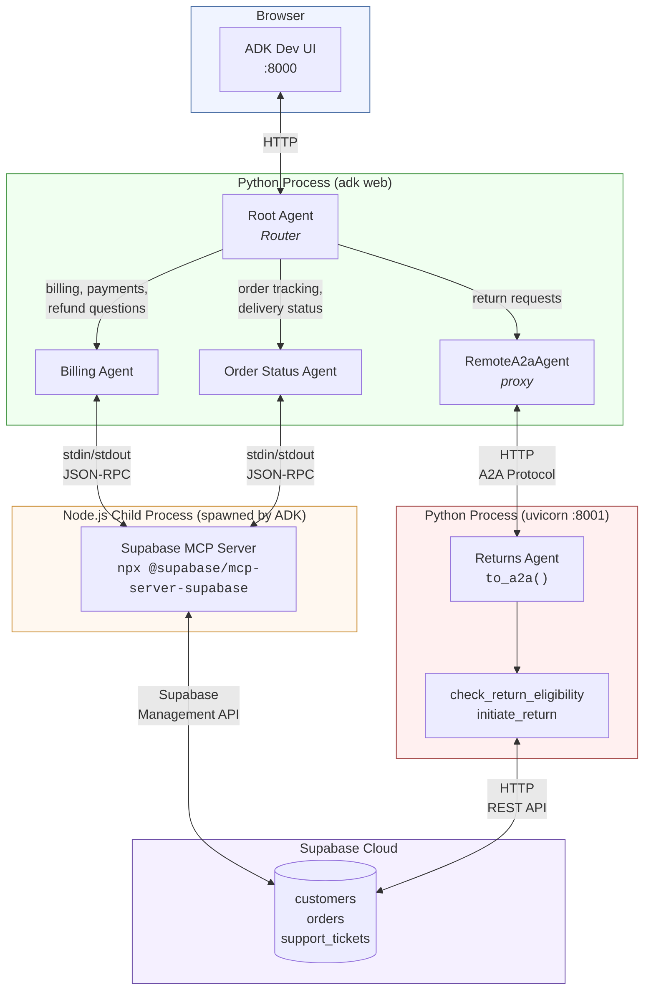

# Week 3: Multi-Agent Hat Store Customer Support

A multi-agent customer support system for **Hats R Us** built with Google's Agent Development Kit (ADK), Supabase (via MCP), and the A2A protocol.

## Architecture



## Design Decisions

### Why two different data access patterns?

**Billing + Order Status agents use MCP (LLM writes SQL)** — these handle open-ended queries where the customer might ask anything: "what did I spend last month?", "show me all my fedoras", "which orders are still pending?" The LLM needs flexibility to construct arbitrary queries.

**Returns agent uses deterministic tools (hardcoded business logic)** — return policy has strict rules (30/60-day window, no custom hats, must be delivered). These rules should be enforced exactly, not left to an LLM interpreting SQL results. The Python tools call the Supabase REST API directly and return a clear eligible/ineligible verdict.

### Why A2A for the returns agent?

The returns agent runs as a separate service to demonstrate the A2A protocol. This models a real-world scenario where the returns system is owned by a different team or deployed independently. The `RemoteA2aAgent` in the main system acts as a proxy — ADK routes to it like any other sub-agent, but under the hood it makes HTTP calls to the remote service.

**Key limitation discovered:** A2A only passes conversation text between agents, not session state. The remote agent can't access `{user_email}` or `{customer_id}` from the main agent's session. We solved this by making the returns tools resolve everything from just the `order_id` (following the order's `customer_id` foreign key to look up membership tier).

### Why ADK tool filtering instead of --read-only?

The Supabase MCP server exposes 30+ tools (`apply_migration`, `deploy_edge_function`, `create_branch`, etc.). Rather than relying on the server's `--read-only` flag, we use ADK-level `tool_filter=["list_tables", "execute_sql"]` to restrict what the LLM can even see. This is a stronger boundary — the filtering happens in ADK before tool definitions reach the model.

### Why session state for user identity?

ADK supports template variables in agent instructions (`{user_name}`, `{customer_id}`) that auto-substitute from session state. This simulates a real auth flow where the backend resolves a session token into user context before the agent runs. The agents never ask "who are you?" — they already know.

## Running

```bash
cd week3
uv sync
cp .env.example .env  # fill in credentials

# Terminal 1: Returns A2A service
uv run uvicorn returns_service.agent:a2a_app --port 8001

# Terminal 2: ADK Dev UI
uv run adk web .
# Opens at http://localhost:8000
```

Set user context in ADK Dev UI via three-dot menu > "Update state":

```json
{
  "user_name": "Alice Chen",
  "user_email": "alice.chen@email.com",
  "membership_tier": "gold",
  "customer_id": "a0000000-0000-0000-0000-000000000001"
}
```

## Test Scenarios

| # | Scenario | State | Message | Tests |
|---|---|---|---|---|
| 1 | Billing (MCP) | Alice Chen (gold) | "Can you check my recent charges?" | Routing, MCP SQL, Supabase query |
| 2 | Returns with ID (A2A) | Iris Thompson (bronze) | "I want to return order b0000000-...-000000000007" | Routing, A2A protocol, eligibility logic, ticket creation |
| 3 | Returns without ID | Iris Thompson (bronze) | "I want to return an order" | Root agent asks for order ID or offers lookup via order_status_agent |
| 4 | Escalation | Any user | "I want to speak to a manager about hat quality" | Root agent handles directly, no sub-agent |

## Database

20 customers, 100 orders, 15 support tickets. Key test fixtures for return eligibility:

| Order | Customer | Tier | Age | Style | Eligible? |
|---|---|---|---|---|---|
| `...001` | Alice Chen | gold | 10d | fedora | Yes |
| `...002` | Alice Chen | gold | 45d | panama | Yes (gold=60d) |
| `...003` | Bob Martinez | gold | 70d | cowboy | No (past 60d) |
| `...006` | Iris Thompson | bronze | 5d | custom | No (custom hat) |
| `...007` | Iris Thompson | bronze | 20d | bucket | Yes |
